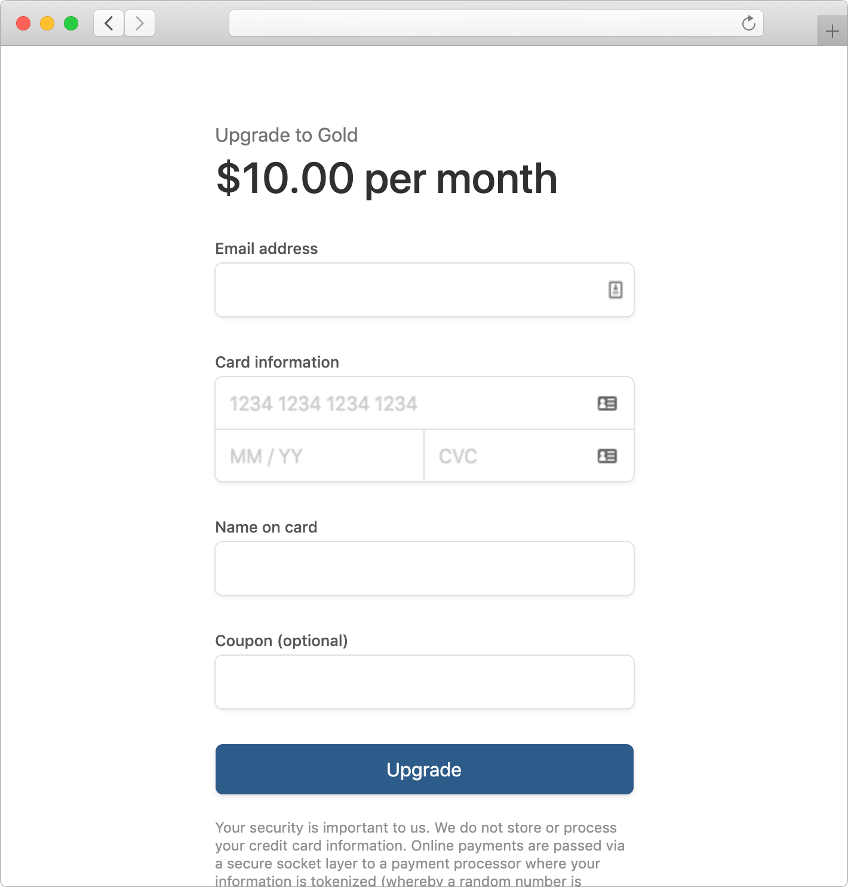

# Checkout
A simple, lightweight, checkout page for Stripe SaaS subscriptions featuring:
- Client-side payment form
- Server-side subscription management
- EU VAT validation
- Tax rates
- Coupon codes
- SCA compliant with 3D Secure 2 authentication
- Single subscriptions per customer
- Single payment methods per customer
- Re-use existing saved card details

## Getting Started

```
npm install --save checkout
```

#### app.js

```js
// Initialize server-side library with your stripe secret key
const checkout = require('checkout')(STRIPE_SECRET_KEY);

// Serve the client-side library
app.use('/js/checkout.js', express.static('./node_modules/checkout/dist/checkout.js'));

// Render the checkout page
app.get('/upgrade', async (req, res) => {
  // Render the payment form and pass the required client-side config values
  res.render('checkout', {
    checkout: {
      stripePublicKey: STRIPE_PUBLIC_KEY,
      clientSecret: await checkout.getClientSecret(),
    }
  });
});

// Update the subscription
app.post('/upgrade', async (req, res) => {
  // Create a stripe customer and upgrade the subscription
  const stripeCustomerId = await checkout.manageSubscription(null, {
    plan: '<plan_id>',
    email: req.body.email,
    name: req.body.name,
    country: req.body.country,
    vat: req.body.vat,
    coupon: req.body.coupon,
    paymentMethod: req.body.paymentMethod,
  });
  // Save the stripeCustomerId...
  // req.user.stripeCustomerId = stripeCustomerId;
  res.redirect('/');
});
```

#### checkout.pug

```pug
html
  head
    title Payment Details
    meta(name="viewport" content="width=device-width, initial-scale=1")

    script(src="https://js.stripe.com/v3/")
    script(src="/js/checkout.js")

  body
    //- Mounting point for the payment form
    #checkout

    //- Initialize the client-side library
    script.
      Checkout({
        stripePublicKey: checkout.stripePublicKey,
        clientSecret: checkout.clientSecret,
      });
```

#### Screenshot




## Client-Side Configuration
Initialize the client-side with one line of code to automatically create a complete payment form. Several configuration options and customization points are available.

```js
Checkout({
  stripePublicKey: '...',
  clientSecret: '...',
  header: 'Upgrade your plan!',
  title: '$10.00 per month',
  action: 'Upgrade',
  email: true,
  card: true,
  name: true,
  country: true,
  postcode: true,
  vat: false,
  coupon: true,
  disclaimer: false,
  provider: false,
  vatValidationUrl: '/validateVat',
  couponValidationUrl: '/validateCoupon',
  taxOrigin: 'SE',
  prefill: {
    customer: {
      email: 'customer@example.com',
      name: 'Bob',
      country: 'GB',
      postcode: 'ABC 123',
      vat: 'GB123123123'
    },
    card: {
      month: 4,
      year: 2024,
      last4: '1234'
    }
  }
});
```


#### Required
- `stripePublicKey` - Your Stripe account public key
- `clientSecret` - Client secret generated using the server-side library helper `checkout.getClientSecret()`

#### Customization
- `header` - Header text shown above the title
- `title` - Title text shown above the payment form
- `action` - Text shown on the submit button
- `disclaimer` Disclaimer text (`true`/`false`/`'Custom disclaimer text...'`)
- `provider` Provider information (`true`/`false`)
- `email` - Email field (`true`/`false`/`'disable'`) 
- `card` - Card input (`true`/`false`/`'disable'`) 
- `name` - Name field (`true`/`false`/`'disable'`) 
- `country` - Country field (`true`/`false`/`'disable'`) 
- `postcode` - Postal code field (`true`/`false`/`'disable'`) 
- `vat` - VAT field (`true`/`false`/`'disable'`) 
- `coupon` - Coupon field (`true`/`false`/`'disable'`) 
- `vatValidationUrl` - Endpoint to validate VAT numbers (see below)
- `couponValidationUrl` - Endpoint to validate coupons (see below)
- `taxOrigin` - Country where you pay tax (used to determine toggle the VAT field)
- `prefill` - Prefill customer and card details

#### Prefill Customer
- `email` - Pre-fill customer email address
- `name` - Pre-fill customer name
- `country` - Pre-fill customer country (ISO 3166 alpha-2 country code)
- `vat` - Pre-fill customer vat number
- `coupon` - Pre-fill coupon code

#### Prefill Card
- `month` - Expiry month (e.g. `6`)
- `year` - Expiry year (e.g. `2024`)
- `last4` - Last 4 digits (e.g. `'1234'`)


## Server-Side API
The server-side helper library provides several easy-to-use helpers to manage Stripe subscriptions.

### `checkout.getClientSecret`
Generates a client secret required to render the client-side checkout page.

### `checkout.getSubscription( stripeCustomerId )`
Retrieve the current subscription status. Returns `null` if there is no active subscription.

```js
{ id: 'sub_xxx',
  valid: true,
  cancelled: false,
  card:
   { brand: 'visa',
     month: 4,
     year: 2024,
     last4: '4242',
     summary: 'Visa ending in 4242 (04/24)' },
  plan:
   { id: 'plan_xxx',
     name: 'Gold - Monthly',
     metadata: { product: 'gold', plan: 'monthly' },
     amount: 499,
     currency: 'usd',
     interval: 'month' },
  customer:
   { id: 'cus_xxx',
     email: 'customer@example.com',
     name: 'John Smith',
     country: 'IE',
     vat: 'IE6388047V' },
  status: 'Renews on Aug 31, 2019' }
```

- `valid` - True if the subscription is in a valid state.
- `cancelled` - True if the subscription will cancel at the end of the period
- `card` - Card details
- `plan` - Plan details
- `customer` - Customer details
- `status` - Text friendly description (see below)

#### Status
- Trailing until <trial_end>
- Cancels on <current_period_end>
- Renews on <current_period_end>
- Invalid payment method (requires action)
- Invalid payment method
- Waiting for a new attempt
- Past due


### `checkout.manageSubscription( stripeCustomerId, { ... } )`
If `stripeCustomerId` is `null` then a new customer will be created automatically. The function always returns a stripe customer ID so that you can associate it with a user in your application.

#### Options
- `plan` - Update subscription plan (upgrade/downgrade)
- `email` - Update customer email
- `name` - Update customer name
- `country` - Update customer country code
- `paymentMethod` - Update default payment method (new credit card)
- `coupon` - Update subscription coupon code
- `trialDays` - Update subscription trial days
- `vat` - Update customer VAT number
- `taxOrigin` - The country where you pay tax (e.g. SE)
- `taxRates` - Tax rates to apply

#### Taxation
EU VAT taxation is automatically determined. If your `taxOrigin` is an EU country and a valid VAT number and an EU country code is provided then the customer taxation status will be set to `reverse`. Non-EU countries will be set to `exempt`. All other will be set to taxable. Note that tax will only be applied if a `tax_rate` ID is provided. 

```
taxOrigin is EU AND country is taxOrigin => taxable
taxOrigin: SE and country: SE => taxable
taxOrigin: EU-country AND country == reverse
```

Individual tax rates per country are supported (e.g. different EU tax rates) as well as a default tax rate that will be applied otherwise.

```js
{ 
  taxOrigin: 'SE',
  taxRates: { default: '...' } 
}

{ 
  taxOrigin: 'SE',
  taxRates: {
    US: '...',
    default: '...',
  }
}
```

### `checkout.cancelSubscription( stripeCustomerId, atPeriodEnd = true )`
Cancel an existing subscription (default at period end).

### `checkout.reactivateSubscription( stripeCustomerId )`
Reactivate a cancelled subscription.

### `checkout.deleteSubscription( stripeCustomerId )`
Immediately delete a subscription.

### `checkout.deleteCustomer( stripeCustomerId )`
Delete and cancel the customer's subscription.

### `checkout.getReceipts( stripeCustomerId )`
List all recent receipts. Returns an empty array `[]` if an invalid customer ID is provided.

```js
[ { date: 'Jul 31, 2019',
    currency: 'usd',
    amount: 499,
    url:
     'https://pay.stripe.com/invoice/invst_xxx/pdf' } ]
```

### `checkout.validateVatNumber`
Helper to validate VAT numbers. See [VAT number validation]()

### `checkout.validateCoupon`
Helper to validate coupon codes. See [Coupon validation]()


## VAT number validation
If a `vatValidationUrl` is passed to the client-side library initialization, then the VAT number will be validated using a `GET` request to the specified URL, with a query string parameter `q` containing the VAT number. If the response status code is `200` then validation succeeds. Any other status code will fail.

```
GET /validateVatNumber?q=SE1234567891001
```

You can easily implement an API endpoint in your backend using the server-side Checkout helper function (or provide your own implementation). The default implementation wraps the [VIES VAT number validation](http://ec.europa.eu/taxation_customs/vies/) SOAP endpoint.

```js
app.get('/validateVatNumber', (req, res) => {
  checkout.validateVatNumber(req.query.q).then(valid => {
    res.status(valid ? 200 : 400).json({ valid });
  });
});
```

Initialize client-side library:

```js
Checkout({
  vatValidationUrl: '/validateVatNumber',
  ...
})
```


## Coupon validation

```js
Checkout({
  couponValidationUrl: '/validateCoupon',
  ...
})
```

```
GET /validateCoupon?q=HELLO123
```

```js
app.get('/validateCoupon', (req, res) => {
  checkout.validateCoupon(req.query.q).then(valid => {
    res.status(valid ? 200 : 400).json({ valid });
  });
});
```


## Example Implementation
The example projects includes a simple web app that allows a user to view their subscription, upgrade, change card, cancel and reactivate their subscription.

[Example](example/)
