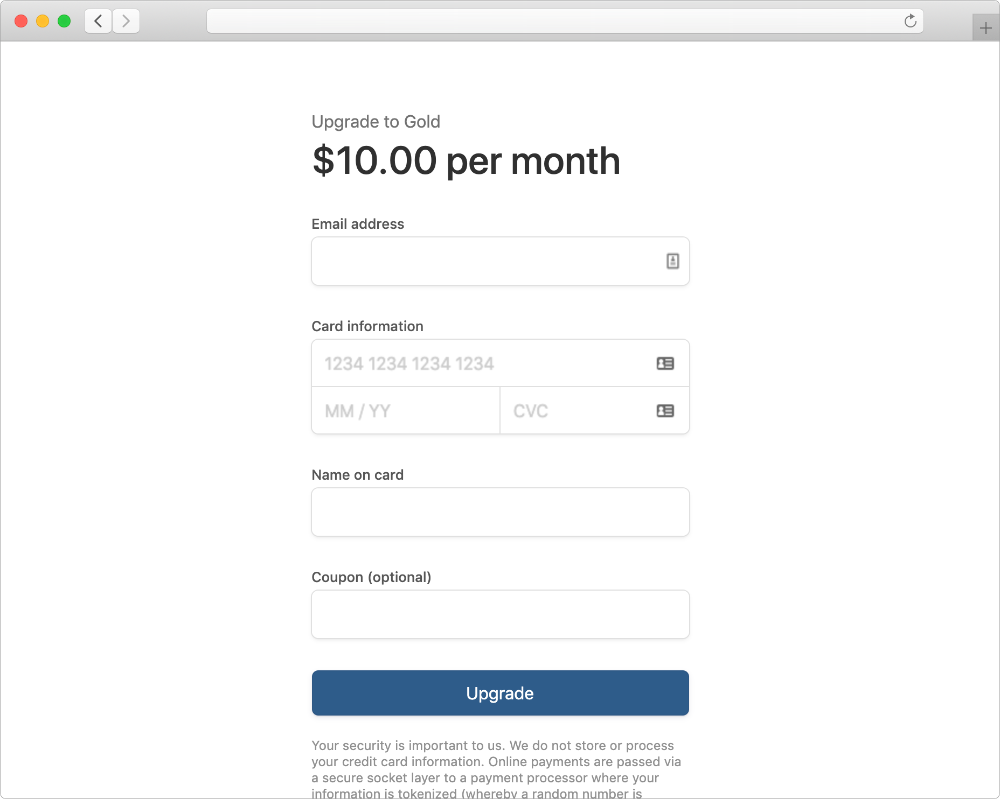

# Checkout
A simple, lightweight, checkout page for Stripe SaaS subscriptions. The library contains server-side wrappers for managing Stripe subscriptions. The client-side library contains a pre-built payment form. Supports VAT validation and coupon codes. Currently only supports single subscriptions and single cards per customer. SCA compatible with 3D Secure 2 authentication.

```
npm i checkout
```

## Getting Started

app.js

```js
const checkout = require('checkout')(STRIPE_SECRET_KEY);

app.use('/js/checkout.js', express.static('./node_modules/checkout/dist/checkout.js'));

app.get('/upgrade', async (req, res) => {
  res.render('checkout', {
    checkout: {
      stripePublicKey: STRIPE_PUBLIC_KEY,
      clientSecret: await checkout.getClientSecret(),
    }
  });
});

app.post('/upgrade', async (req, res) => {
  const stripeCustomerId = await checkout.updateSubscription(null, {
    plan: '<plan_id>',
    email: req.body.email,
    name: req.body.name,
    country: req.body.country,
    vat: req.body.vat,
    coupon: req.body.coupon,
    payment_method: req.body.payment_method,
  });
  res.redirect('/');
});
```

checkout.pug

```pug
html
  head
    title Payment Details
    meta(name="viewport" content="width=device-width, initial-scale=1")

    script(src="https://js.stripe.com/v3/")
    script(src="/js/checkout.js")

  body
    #checkout
    script.
      Checkout(!{JSON.stringify(checkout)});
```

screenshot




## Client-Side Configuration
The client-side library supports several configuration options and customization points.

```js
Checkout({ ... })
```

#### Required
- `stripePublicKey` - Your Stripe account public key
- `clientSecret` - Client secret generated using `checkout.getClientSecret()`

#### Customization
- `header` - Header text shown above the title
- `title` - Title text shown above the payment form
- `action` - Text shown on the button
- `disableEmail` - Don't allow the user to change their email (e.g. if pre-filled)
- `hideVatNumber` - Don't show the VAT number field for EU countries
- `showCoupon` - Show the coupon code field
- `vatValidationUrl` - An endpoint used to validate the VAT number (see below)

#### Pre-filling
- `email` - Pre-fill email address
- `name` - Pre-fill name
- `country` - Pre-fill country (ISO 3166 alpha-2 country code)
- `coupon` - Pre-fill coupon code
- `vat` - Pre-fill vat number


## Server-Side API
The server-side helper library provides several easy-to-use helpers to manage Stripe subscriptions.

### `checkout.getClientSecret`
Generates a client secret required for the checkout page.

### `checkout.getSubscription( stripeCustomerId )`
Retrieve the current subscription status


### `checkout.manageSubscription( stripeCustomerId, { ... } )`
If `stripeCustomerId` is `null` then a new customer will be created automatically. The function always returns a stripe customer ID so that you can associate it with a user in your application.

#### Options
- `plan` - Update subscription plan (upgrade/downgrade)
- `email` - Update customer email
- `name` - Update customer name
- `country` - Update customer country code
- `payment_method` - Update default payment method (new credit card)
- `coupon` - Update subscription coupon code
- `trial_period_days` - Update subscription trial days
- `vat` - Update customer VAT number
- `tax_rate` - Update default tax rate

#### Taxation
EU VAT taxation is automatically determined. If a valid VAT number and an EU country code is provided then the customer taxation status will be set to `reverse`. Non-EU countries will be set to `exempt`. All other will be set to taxable. Note that tax will only be applied if a `tax_rate` ID is provided.

### `checkout.cancelSubscription( stripeCustomerId, atPeriodEnd = true )`
Cancel an existing subscription (default at period end).

### `checkout.reactivateSubscription( stripeCustomerId )`
Reactivate a cancelled subscription.

### `checkout.deleteSubscription( stripeCustomerId )`
Immediately delete a subscription.

### `checkout.deleteCustomer( stripeCustomerId )`
Delete and cancel the customer's subscription.

### `checkout.getReceipts( stripeCustomerId )`
List all recent receipts.

### `checkout.validateVatNumber`
Helper to validate VAT numbers. See [VAT number validation]()


## VAT number validation
If a `vatValidationUrl` is provided, then the VAT number will be validated using a `GET` request to the specified URL, with a query string parameter `q` containing the VAT number. If the response status code is 200 then validation succeeds. Any other status code will fail.

```
GET /validateVatNumber?q=SE1234567891001
```

You can easily implement an API endpoint in your backend using the server-side Checkout helper function, or your own implementation. The default implementation uses the [VIES VAT number validation](http://ec.europa.eu/taxation_customs/vies/) SOAP endpoint.

```
app.get('/validateVatNumber', (req, res) => {
  checkout.validateVatNumber(req.query.q).then(valid => {
    res.status(valid ? 200 : 400).json({ valid });
  });
});
```


## Example Implementation
The example projects includes a simple web app that allows a user to view their subscription, upgrade, change card, cancel and reactivate their subscription.

[Example](example/)
